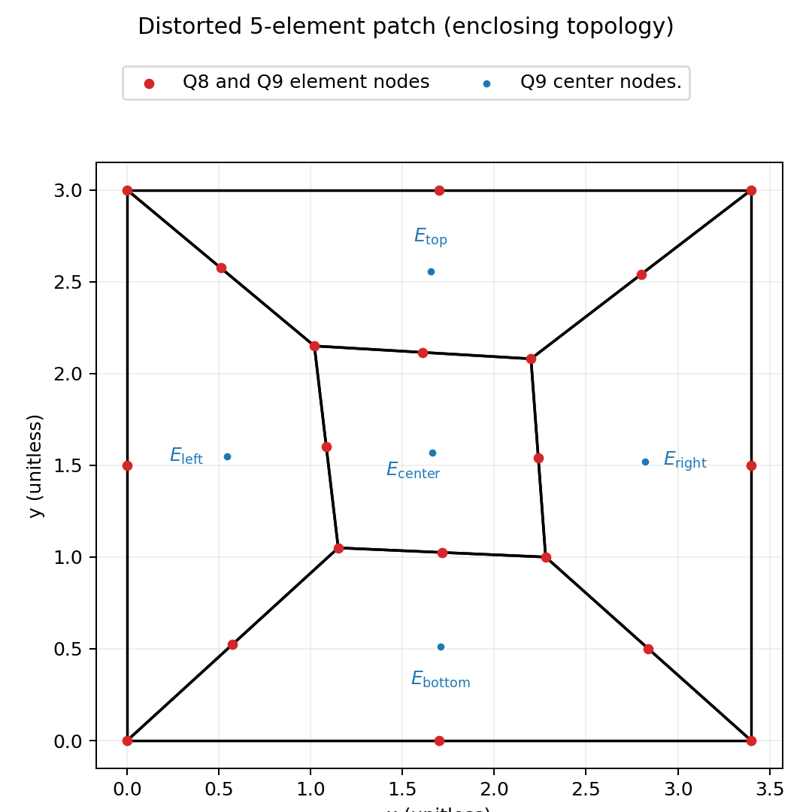

# Patch Test Suite (`tests/patch_test`)

This folder contains focused patch tests for the heterosis plate element that are easier to inspect and reason about than full-problem integration cases.

## File layout

Tests are split by scenario:

- `test_five_element_patch.py`: distorted 5-element enclosing patch checks and diagnostics
- `test_single_element_eigen.py`: distorted single-element eigen diagnostics
- `_helpers.py`: shared builders, sampling helpers, and plotting/report helpers

Within each file there is one numerical-check test and one diagnostics-output test.

## What the five-element patch tests do

- `test_patch_strain_fields_checked_componentwise`
- `test_patch_strain_plots_and_report_saved_to_output`

They use the same setup; the first checks numerics only, the second also writes plots/report.

## Geometry used in the patch

The five-element patch has **5 Q8 elements** arranged as:

- one center element (`E_center`) that is intentionally distorted
- four neighbors (`E_top`, `E_left`, `E_right`, `E_bottom`) that enclose the center
- an overall **rectangular perimeter** (not a plus-shape extraction)

Element labels in the geometry figure use mathtext rendering:

- `$E_{\mathrm{top}}$`
- `$E_{\mathrm{left}}$`
- `$E_{\mathrm{center}}$`
- `$E_{\mathrm{right}}$`
- `$E_{\mathrm{bottom}}$`

This geometry is built directly by providing:

- `node_coordinates`: explicit coordinates for corners and midside nodes
- `w_location_matrix`: explicit element-to-node mapping for all 5 elements

Why explicit arrays are used here:

- topology is controlled exactly
- shape intent is visually obvious in diagnostics
- tests stay stable when mesh-generation utilities evolve

## Why a polynomial state is prescribed

The tests do not solve a global system. Instead they prescribe a known displacement/rotation field:

- `theta_x = a*x + b*y + c`
- `theta_y = b*x + e*y + f`
- `w = 0.5*a*x^2 + b*x*y + 0.5*e*y^2 + (c+gx)*x + (f+gy)*y + k0`

This is a manufactured field designed so expected strain components are known constants:

- `kappa_xx = a`
- `kappa_yy = e`
- `kappa_xy = 2b`
- `gamma_xz = gx`
- `gamma_yz = gy`

This lets the test check extraction and mapping of each component independently of solver boundary-condition effects.

## Sampling and field extraction path

For every element and every 3x3 quadrature point:

1. Build element geometry (`mesh.get_geometry_coordinates`)
2. Gather local dofs (`local_to_global_dof_indices`, then `u_local = u[gdofs]`)
3. Compute bending terms with `bending_B_matrix(...) @ u_local`
4. Compute shear terms with `shear_B_matrix(...) @ u_local`
5. Accumulate sampled values for all five strain components

The tests verify:

- sampled arrays exist and are finite
- spread and absolute errors versus expected component constants are finite

## Diagnostics written to output

`test_patch_strain_plots_and_report_saved_to_output` writes files to:

- `output/integration_patch_diagnostics/patch_diagnostics/`

Artifacts:

- `patch_geometry_5element_distorted.png`: element outlines with labels and w-nodes
- `strain_field_report.txt`: compact numeric summary (min/max/spread/max error)

### Patch geometry figure

<p align="center">
  
</p>

`test_single_element_eigenvalue_plot_and_report_saved_to_output` writes files to:

- `output/integration_patch_diagnostics/eigen_diagnostics/`

## Running these tests

From repository root:

```bash
pytest tests/patch_test -q
```

Run one test only:

```bash
pytest tests/patch_test/test_five_element_patch.py::test_patch_strain_fields_checked_componentwise -q
```

Single-element-only:

```bash
pytest tests/patch_test/test_single_element_eigen.py -q
```
